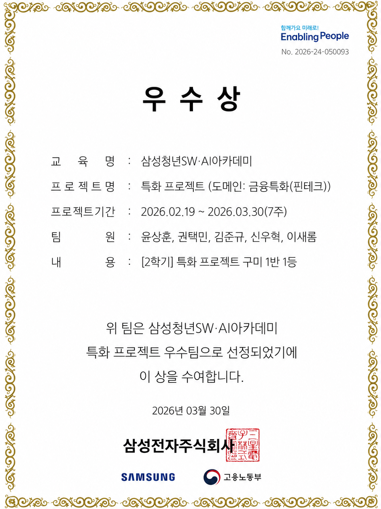
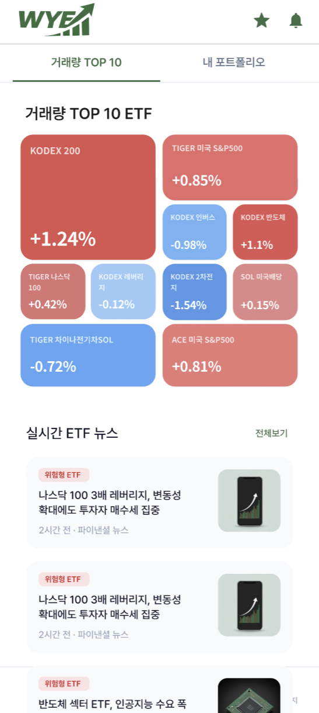
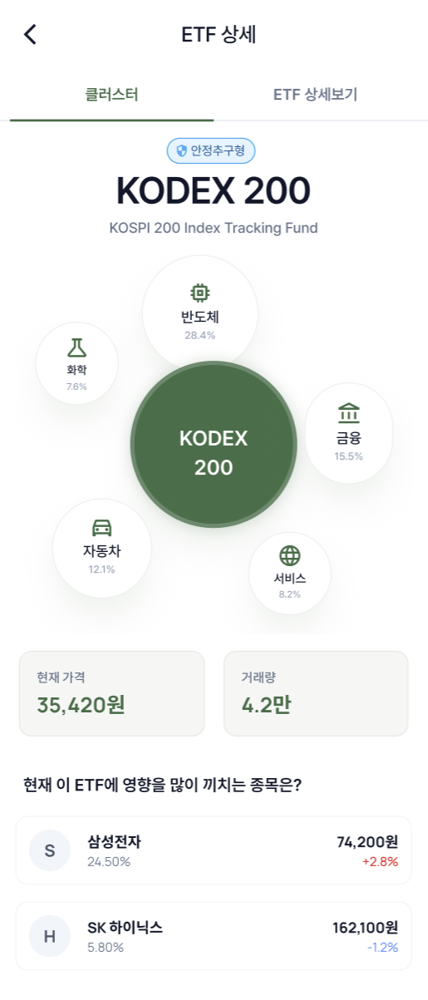
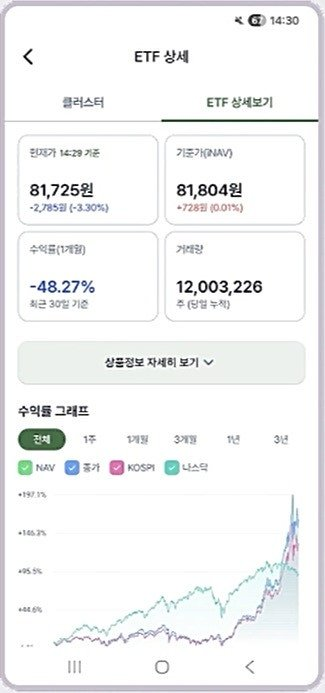
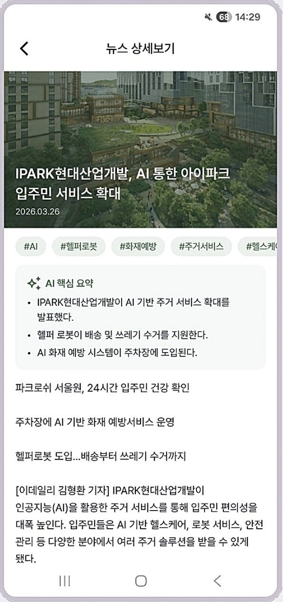
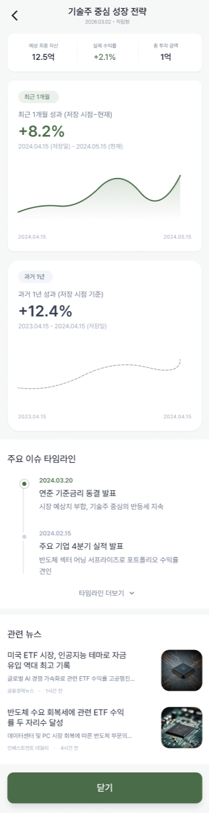
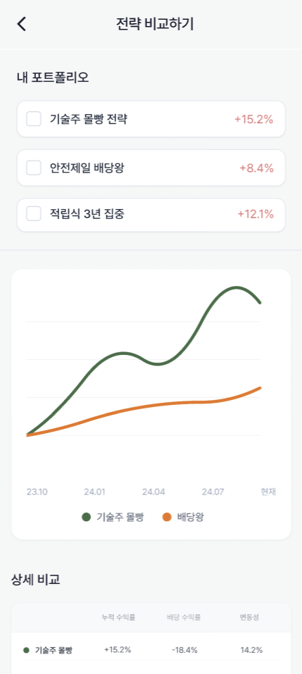
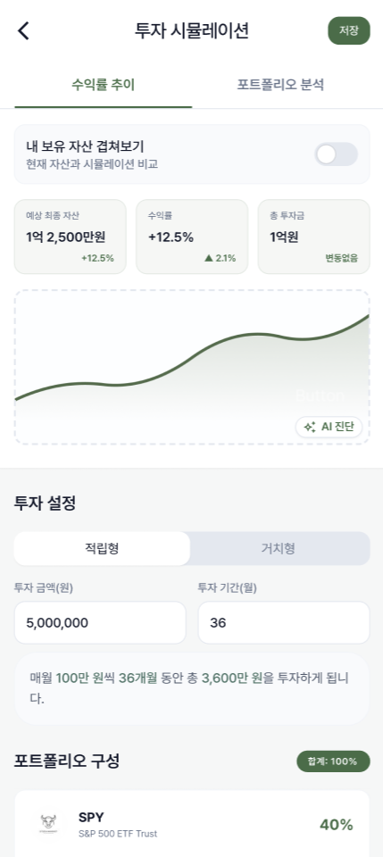
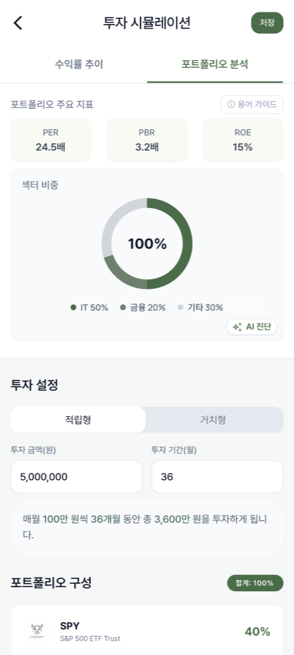
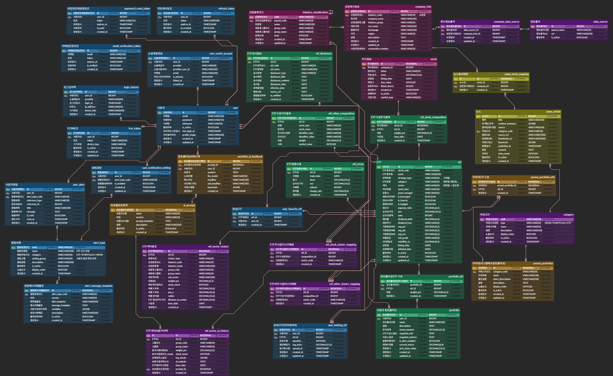

# What's Your ETF

> ## 💸 ETF 속 숨은 관계를 시각화하고, 나만의 전략을 시뮬레이션하는 핀테크 Android 앱

- **서비스명**: What's Your ETF (WYE)
- **개발 기간**: 2026.02.16 ~ 2026.04.03 (7주)
- **개발 인원**: 5명 (Backend 2 · Android 3)
- **수상**: SSAFY 특화 프로젝트 **1등**

<div align="center">
  
</div>

<br>

# 목차

- [👤 담당 역할 및 기여](#-담당-역할-및-기여)
- [💡 기획 배경](#-기획-배경)
- [✨ 서비스 주요 기능](#-서비스-주요-기능)
- [🖥️ 화면](#screens)
- [🛠️ 프로젝트 핵심 기술](#core-tech)
- [💡 핵심 문제 해결](#core-problem)
- [🗂️ ERD](#erd)
- [👥 팀원 소개](#-팀원-소개)
- [⚙️ 기술 스택](#tech-stack)

<br>

# 👤 담당 역할 및 기여

### 🫧 ETF 섹터 분석

> ETF 하나가 어떤 산업에 얼마씩 투자하고 있는지를 한눈에 보여주는 기능입니다.

| 기능 | 구현 |
|:---|:---|
| **산업 분류 기준 직접 설계** | 주식을 '반도체·자동차·바이오·금융' 같은 21개 산업군과 135개 세부 분야로 나누는 기준을 직접 만들고, 종목 1,228개를 하나하나 분류 |
| **ETF 성격에 맞춘 분류 보정** | 같은 종목도 ETF 성격에 따라 다르게 봐야 함 (예: 삼성전자가 반도체 ETF에선 '반도체', 로봇 ETF에선 '로봇'). 어긋나는 600여 건을 ETF별로 직접 바로잡음 |
| **버블 차트로 시각화** | 산업별 비중을 모아, 비중이 클수록 크고 가운데에 놓이는 버블 차트로 가공 |
| **AI 설명 생성** | 각 ETF의 산업 구성이 어떤 특징인지 AI가 풀어 설명하는 글을 2,200여 건 생성 |

### 📰 뉴스 자동 수집 · AI 분석 · 맞춤 알림

> 투자에 필요한 뉴스를 모아 AI로 요약하고, 관련 ETF와 연결해 알림까지 보내는 전 과정입니다.

| 기능 | 구현 |
|:---|:---|
| **필요한 뉴스만 자동 수집** | 인기·관심 ETF에 담긴 종목들의 뉴스만 골라 하루 2회 자동 수집 (중복·광고성 기사 제거) |
| **AI 요약·분류** | 긴 기사를 3줄로 요약하고, 키워드·긍정/부정·어떤 산업 뉴스인지 자동 분류 |
| **뉴스와 ETF 연결** | 그 뉴스가 어떤 ETF에 영향을 주는지 산업 비중을 따져 연결 |
| **맞춤 푸시 알림** | 영향받는 ETF를 관심 등록해 둔 사용자에게만 휴대폰 푸시 알림 발송 |

### 🗄️ 그 외 백엔드

| 기능 | 구현 |
|:---|:---|
| **데이터 설계 · 수집 자동화** | ETF·종목·뉴스 정보를 담는 데이터 구조를 설계하고, 정해진 시각에 자동으로 최신 데이터를 수집 |
| **캐싱 · 이벤트 처리** | Redis 캐시로 반복 조회 부하를 줄이고, RabbitMQ 이벤트로 뉴스 알림을 본 요청과 분리해 비동기 처리 |
| **조회 성능 최적화** | JPA 리포지토리 전반에 N+1 방지(EntityGraph·Fetch Join)와 복합 인덱스를 적용 |
| **AI 포트폴리오 해석** | 사용자가 만든 ETF 조합의 성향을 외부 AI로 요약 |
| **로그인 · 회원** | 카카오 소셜 로그인, 회원·마이페이지 |

### 👑 팀장
- 5명 팀의 7주 일정 관리, 서버 간 연동 흐름 등 프로젝트 문서화

<br>

# 💡 기획 배경

### ETF는 늘었는데, 고를 도구가 없다

<table>
  <tr>
    <td align="center" width="25%">📈<br/><b>1,000개+ ETF</b><br/><sub>국내 상장 ETF가 1,000개 이상으로 급증 — 무엇을 고를지 막막</sub></td>
    <td align="center" width="25%">🧩<br/><b>단편적 정보</b><br/><sub>수익률 순 나열뿐, ETF의 산업별 노출도(섹터)는 보여주지 않음</sub></td>
    <td align="center" width="25%">🧪<br/><b>시뮬레이션 부재</b><br/><sub>내가 구성한 조합이 실제로 어떤 성과를 냈을지 검증할 방법이 없음</sub></td>
    <td align="center" width="25%">🤔<br/><b>해석 수단 부재</b><br/><sub>"이 조합이 어떤 특성인지" 판단해줄 도구가 없음</sub></td>
  </tr>
</table>

### **💸 What's Your ETF 💸**

> **앱에 의존하는 게 아니라, 스스로 정보를 찾고 판단하는 도구를 제공한다**

- 🫧 **섹터로 본다** — ETF 구성종목의 산업 노출도를 버블 차트로 한눈에
- 🧮 **직접 구성한다** — 슬라이더로 비중을 조절하고 지표·수익률을 시뮬레이션
- 🤖 **AI가 해석한다** — Claude + GPT 폴백으로 포트폴리오 구성 특성을 요약
- 🔔 **놓치지 않는다** — 내 포트폴리오가 5% 이상 변동하면 FCM 푸시

<br>

# ✨ 서비스 주요 기능

### 🫧 ETF 섹터 클러스터

- ETF 구성종목의 산업분류 비중을 집계해 버블 차트로 시각화
- 12시 방향부터 시계방향 배치, 비중 높을수록 중심에 크게 — "이 ETF는 반도체 40%, 금융 25%, IT 15%…"처럼 섹터 노출도를 한눈에

### 🔍 ETF 탐색 · 상세

- ETF 시세·수익률·배당·구성종목·공시 정보 조회
- 산업별 노출도(섹터 클러스터)와 함께 ETF 특성 파악

### 📈 시장 지수

- 코스피·코스닥 등 주요 시장 지수 추이 확인

### 🧮 포트폴리오 빌더

- 슬라이더로 여러 ETF의 비중을 조절해 나만의 포트폴리오 구성
- PER/PBR/ROE 가중 평균 지표 계산

### 🧰 프리셋 포트폴리오

- 테마·전략별 추천 포트폴리오를 골라 바로 시뮬레이션

### 📊 백테스트

- "1년 전에 이 조합을 샀다면 지금 수익률은?" — 과거 특정 시점 기준 기간 수익률 시뮬레이션
- 누적·연환산 수익률(CAGR)·최대 낙폭(MDD)·샤프지수·월별 수익률, 리밸런싱 주기 반영

### 🤖 LLM 포트폴리오 해석

- Claude API로 포트폴리오 구성 특성을 헤드라인·키워드·분석으로 요약
- 호출 실패 시 GPT-4o로 자동 폴백

### 📰 뉴스 AI 분석 + ETF 연결

- 긴 뉴스 기사를 GPT-4o-mini가 3줄로 요약하고 반도체·금융 등 산업으로 자동 분류
- 뉴스에 태깅된 종목 기반으로 해당 종목을 보유한 ETF를 자동 매핑

### 🔔 포트폴리오 · 뉴스 알림

- 장 시작 전(08:50) 기준가를 저장해 두고 장 중 1분 간격으로 비교, 5% 이상 변동하면 휴대폰 푸시 알림
- 관심 종목 새 뉴스도 실시간 푸시 알림

### 🔐 소셜 로그인 · 마이페이지

- Kakao OAuth 로그인, 관심 ETF·포트폴리오 관리

<br>

<a name="screens"></a>

# 🖥️ 화면

### 🔍 탐색 · 분석

<table>
  <tr>
    <td align="center" width="25%"></td>
    <td align="center" width="25%"></td>
    <td align="center" width="25%"></td>
    <td align="center" width="25%"></td>
  </tr>
  <tr>
    <td align="center"><b>홈</b><br/><sub>거래량 TOP 10 · 실시간 ETF 뉴스</sub></td>
    <td align="center"><b>ETF 상세 · 클러스터</b><br/><sub>산업별 노출도를 버블 차트로 시각화</sub></td>
    <td align="center"><b>ETF 상세보기</b><br/><sub>기준가(NAV) · 수익률 그래프 · 거래량</sub></td>
    <td align="center"><b>뉴스 AI 분석</b><br/><sub>AI 3줄 요약 · 산업 자동 분류 · ETF 연결</sub></td>
  </tr>
</table>

### 📈 전략 · 시뮬레이션

<table>
  <tr>
    <td align="center" width="25%"></td>
    <td align="center" width="25%"></td>
    <td align="center" width="25%"></td>
    <td align="center" width="25%"></td>
  </tr>
  <tr>
    <td align="center"><b>전략 상세</b><br/><sub>수익률 추이 · 관련 뉴스 타임라인</sub></td>
    <td align="center"><b>전략 비교</b><br/><sub>여러 전략의 수익률을 나란히 비교</sub></td>
    <td align="center"><b>투자 시뮬레이션</b><br/><sub>적립·거치 조건별 과거 수익률 백테스트</sub></td>
    <td align="center"><b>포트폴리오 분석</b><br/><sub>PER·PBR·ROE와 섹터 비중 진단</sub></td>
  </tr>
</table>

<br>

<a name="core-tech"></a>

# 🛠️ 프로젝트 핵심 기술

### 🫧 ETF 섹터 분석

- **산업 분류 기준 직접 설계**: 주식을 '반도체·자동차·바이오·금융' 등 21개 산업군과 135개 세부 분야로 나누는 기준을 직접 만들고, 종목 1,228개를 하나하나 분류
- **가장 어려웠던 점 — ETF 성격별 산업 매핑**: 같은 종목도 ETF 성격에 따라 다른 산업으로 봐야 함(예: 삼성전자가 반도체 ETF에선 '반도체', 로봇 ETF에선 '로봇'). 종목의 본업으로 일괄 분류한 뒤, 어긋나는 600여 건을 ETF별로 직접 보정
- **시각화**: 산업별 비중을 합산해, 비중이 클수록 크고 가운데에 놓이는 버블 차트 좌표로 변환
- **AI 설명**: 각 ETF의 산업 구성이 어떤 특징인지 AI(Claude)가 풀어 설명하는 글을 2,200여 건 생성

### 🧩 FastAPI · Spring Boot 역할 분리 구조

- 외부 데이터를 모으는 **수집 서버(Python/FastAPI)** 와 사용자 요청을 처리하는 **서비스 서버(Java/Spring)** 를 나눠, 수집 부하가 사용자 응답에 전파되지 않게 함
- 두 서버는 **PostgreSQL·Redis·RabbitMQ**를 공유하며, 역할(수집/비즈니스)에 따라 책임을 분리

### ⚡ Redis 캐싱 + RabbitMQ 이벤트

- 데이터 변동 주기에 따라 캐시 TTL을 다르게 둠 — 실시간 시세는 짧게, 종목·뉴스는 24시간 캐시 후 장 시작 전 일괄 무효화
- 뉴스·알림처럼 무거운 작업은 **RabbitMQ 메시지 큐**(`@RabbitListener`)로 본 요청과 분리해 비동기 처리 → 알림이 늦거나 실패해도 사용자 요청은 정상 처리

### 🔌 외부 증권 API(KIS) 안정적 연동

- 한국투자증권 API의 초당 호출 한도(20건)에 맞춰 **슬라이딩 윈도우 Rate Limiting**(초당 18건)으로 호출 속도를 제어
- OAuth 인증 토큰을 **Double-Checked Locking**으로 중복 발급 없이 관리하고 만료 10분 전 미리 갱신·재사용

### 📰 뉴스 자동 처리 파이프라인

- 인기·관심 ETF 구성종목의 뉴스만 골라 자동 수집(하루 2회, 크롤링 429 지수 백오프·중복·스팸 필터)
- GPT-4o-mini로 요약·산업 분류 → 산업 비중을 따져 영향받는 ETF에 연결 → 그 ETF를 관심 등록한 사용자에게만 **RabbitMQ → FCM** 푸시 알림

### 📊 백테스트 · 포트폴리오 분석

- 과거 시세를 기준으로 누적·연환산 수익률(CAGR)·최대 낙폭(MDD)·샤프지수·리밸런싱을 시뮬레이션
- 포트폴리오의 PER/PBR/ROE 가중 평균 지표 산출

<br>

<a name="core-problem"></a>

# 💡 핵심 문제 해결

### ① 뉴스 알림 처리 — RabbitMQ 비동기 채널 · Transactional Outbox

- **역할 구분** — **RabbitMQ**: 뉴스 분석 결과와 알림 처리 흐름을 사용자 요청과 분리하는 **비동기 이벤트 채널** / **Transactional Outbox**: "알림 저장"과 "발송 요청 기록"을 **같은 DB 트랜잭션에 묶어** 발송 실패를 재시도·격리하는 구조 (둘은 별개 역할)
- **문제** — 관심 ETF 뉴스 알림을 "알림 저장 → FCM 발송" 한 흐름으로 처리하면, 커밋 전에 발송이 나가거나(롤백 시 유령 알림) 실패해도 재시도가 없어 유실될 수 있음
- **원인** — DB 저장과 외부 발송(FCM)이 한 흐름에 묶여 두 작업의 성공/실패가 갈라지는 **dual-write** 문제
- **대안** — ① `@Async` 직발송 — 커밋 전 발송·실패 시 유실 ② RabbitMQ 직접 발행 — 비동기 처리는 가능하지만 DB 저장과 발행 흐름이 분리됨 ③ **Transactional Outbox** — DB 테이블 하나로 원자성 확보
- **선택 이유** — 개발 단계·팀 규모에서는 이미 쓰는 DB에 outbox 테이블 하나로 **원자성 + 재시도 + 다중 릴레이 안전(SKIP LOCKED)** 까지 최소 인프라로 확보 가능
- **해결** — 알림 저장과 발송 요청(`notification_outbox`)을 **같은 트랜잭션**에 적재(PENDING). 별도 `@Scheduled` 릴레이가 `FOR UPDATE SKIP LOCKED`로 PENDING을 선점해 FCM 발송·SENT 처리, 실패는 재시도(최대 5회) 후 `FAILED`로 격리(`retryCount`·`lastError` 기록)
- **결과** — 알림 저장과 발송 요청을 같은 트랜잭션으로 관리하고, 실패 건은 재시도 후 `FAILED`로 격리해 추적 가능하게 함

```java
// NewsAlertService — 알림 저장과 발송 요청을 같은 트랜잭션에 적재 (원자적)
@Transactional
public int process(NewsAnalyzedEvent e) {
    var alerts = buildDeduped(e);          // 중복 사용자 제거
    alertRepo.saveAll(alerts);             // 알림 저장
    outboxRepo.saveAll(toOutbox(alerts));  // 아웃박스 적재 (같은 TX)
}
// Relay(@Scheduled, @Transactional): PENDING을 FOR UPDATE SKIP LOCKED 로 선점
//   → FCM 발송 → SENT / 실패는 재시도(최대 5회) 초과 시 FAILED 로 격리
```

### ② 뉴스·종목 목록 조회 — N+1 제거 + 커서 페이지네이션

- **문제** — 목록 조회 시 연관 데이터를 건마다 다시 조회(N+1)하고, `OFFSET` 페이징은 페이지가 깊어질수록 느려짐
- **원인** — 지연 로딩으로 연관을 매 건 조회, `OFFSET N`은 앞 N행을 읽고 버림
- **대안** — ① `OFFSET` 페이징 — 깊어질수록 느려짐 ② `@EntityGraph` — 선언적이나 세밀한 제어는 약함 ③ **`JOIN FETCH` + 커서** — 조인 명시 + 비용 일정
- **선택 이유** — 무한 스크롤이라 임의 페이지 점프가 필요 없고, 커서는 페이지가 깊어져도 비용이 일정. 연관은 조인으로 직접 제어
- **해결** — 연관을 `LEFT JOIN FETCH`로 한 번에 로딩(뉴스 `category` / 종목 `company`·`industry`), 페이징은 `(publishedAt, id)` **커서**로 전환해 인덱스 시작점을 바로 탐색(같은 시각 중복·누락 방지용 `id` tie-breaker)
- **결과** — 조회 쿼리 수 감소 + 페이지가 깊어져도 응답 비용 일정 (임의 페이지 점프 불가 → 무한 스크롤에 적합)

```java
// 카테고리를 함께 로딩(N+1 제거) + (발행일, id) 커서
@Query("SELECT n FROM NewsArticle n LEFT JOIN FETCH n.category " +
       "WHERE n.isActive = true AND n.contentSummary IS NOT NULL " +
       "AND (n.publishedAt < :ts OR (n.publishedAt = :ts AND n.id < :id)) " +
       "ORDER BY n.publishedAt DESC, n.id DESC")
List<NewsArticle> findByCursor(LocalDateTime ts, Long id, Pageable p);
// 종목 목록도 동일: LEFT JOIN FETCH s.company, s.industry
```

### ③ Redis 캐싱 — 데이터 성격별 TTL 차등

- **문제** — 성격이 다른 데이터를 하나의 TTL로 묶으면 신선도와 효율이 상충
- **원인** — 시세는 자주 바뀌고 구성종목·뉴스는 거의 안 바뀜
- **대안** — ① 단일 TTL 일괄 — 짧으면 비효율·길면 낡은 값 ② **데이터 성격별 TTL 차등**
- **선택 이유** — 변동 주기가 다른 데이터를 하나의 TTL로 묶으면 신선도·효율이 상충 → 자주 바뀌는 것만 짧게, 나머지는 길게
- **해결** — 데이터 변동 주기에 따라 캐시 TTL을 다르게 둠 — 기본 TTL은 1시간, 구성종목·뉴스처럼 자주 바뀌지 않는 데이터는 24시간 캐시 후 장 시작 전 일괄 무효화
- **결과** — 자주 바뀌는 것만 짧게·나머지는 길게 캐시해 DB·외부 API 부하 절감

```java
@Bean
RedisCacheManager cacheManager(RedisConnectionFactory cf) {
    var def = defaultCacheConfig().entryTtl(Duration.ofHours(1)); // 기본 1h
    var configs = Map.of(
        "etfTickers",    def.entryTtl(Duration.ofHours(24)),  // 종목: 24h
        "portfolioNews", def.entryTtl(Duration.ofHours(24))); // 뉴스: 24h, 09시 무효화
    return builder(cf).cacheDefaults(def)
        .withInitialCacheConfigurations(configs).build();
}
```

### ④ 서비스 분리 아키텍처 — 수집/비즈니스 분리 + 부하 격리

- **문제** — 스크래핑·AI 요약 같은 무거운 작업이 사용자 API와 한 프로세스에 있으면 응답 지연이 전이
- **원인** — CPU·메모리·장애를 공유하는 단일 프로세스
- **대안** — ① 단일 프로세스 내 스레드 분리 — CPU·메모리·크래시 공유 ② **별도 서비스로 분리** — 부하·장애 격리
- **선택 이유** — 스크래핑·AI는 무겁고 느려 API와 한 프로세스에 두면 부하가 전이 → 별도 서비스로 격리하고 역할에 맞는 언어(Python 수집 / Spring 비즈니스) 사용
- **해결** — 수집 서버(**FastAPI**)와 서비스 서버(**Spring Boot**)를 분리하고 **RabbitMQ**(`@RabbitListener`)로 결과 이벤트만 비동기 소비, 조회는 REST로 연계
- **결과** — 무거운 수집·AI 작업이 사용자 응답을 막지 않음(부하·프로세스 격리)

```python
# data-service (Python): 금융 데이터 스크래핑 + GPT/Claude 요약 → RabbitMQ (pika)
```
```java
// user-service (Spring Boot): 무거운 작업 없이 결과 이벤트만 비동기 소비
@RabbitListener(queues = "news.alert.queue")
public void onNewsAlert(NewsAlertEvent e) {
    fcmService.sendAsync(e.getUserIds(), e.toPush());  // FCM 푸시 (@Async)
}   // 필요 시 조회는 REST → 스크래핑·수집 부하를 API와 격리
```

<br>

<a name="erd"></a>

# 🗂️ ERD

> 사용자·인증 · ETF · 종목·산업분류 · 섹터 클러스터 · 뉴스 · 포트폴리오 · 백테스트 · 알림

<div align="center">
  
  <br/>
  <a href="https://www.erdcloud.com/d/ZbmsxyCCYBmPnCbTN">🔗 ERDCloud에서 전체 보기</a>
</div>

<br>

# 👥 팀원 소개

<table>
  <tr>
    <td align="center">
      
    </td>
    <td align="center">
      
    </td>
    <td align="center">
      
    </td>
  </tr>
  <tr>
    <td align="center"><b>윤상훈</b><br/><sub>tkdgns1998@gmail.com</sub></td>
    <td align="center"><b>권택민</b><br/><sub>rnjsxorals1@gmail.com</sub></td>
    <td align="center"><b>이새롬</b><br/><sub>rupi2223@gmail.com</sub></td>
  </tr>
  <tr>
    <td align="center">
      
    </td>
    <td align="center">
      
    </td>
    <td align="center"></td>
  </tr>
  <tr>
    <td align="center"><b>신우혁</b><br/><sub>eric728066@gmail.com</sub></td>
    <td align="center"><b>김준규</b><br/><sub>kjk991011@gmail.com</sub></td>
    <td align="center"></td>
  </tr>
</table>

<br>

<a name="tech-stack"></a>

# ⚙️ 기술 스택

### Spring Boot (비즈니스)

<div>
  
  
  
  
  
  
  
  
  
</div>

### FastAPI (데이터 수집)

<div>
  
  
  
  
  
  
  
  
</div>

### Data · Messaging

<div>
  
  
  
</div>

### AI

<div>
  
  
</div>

### Mobile

<div>
  
  
  
  
  
  
  
  
  
</div>

### Infra · External

<div>
  
  
  
  
  
</div>

<br>
